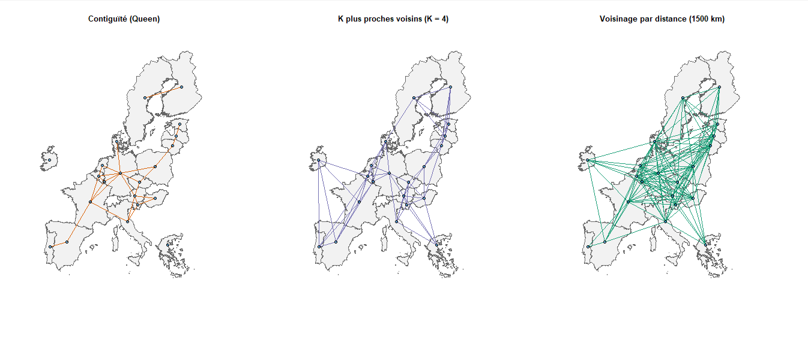
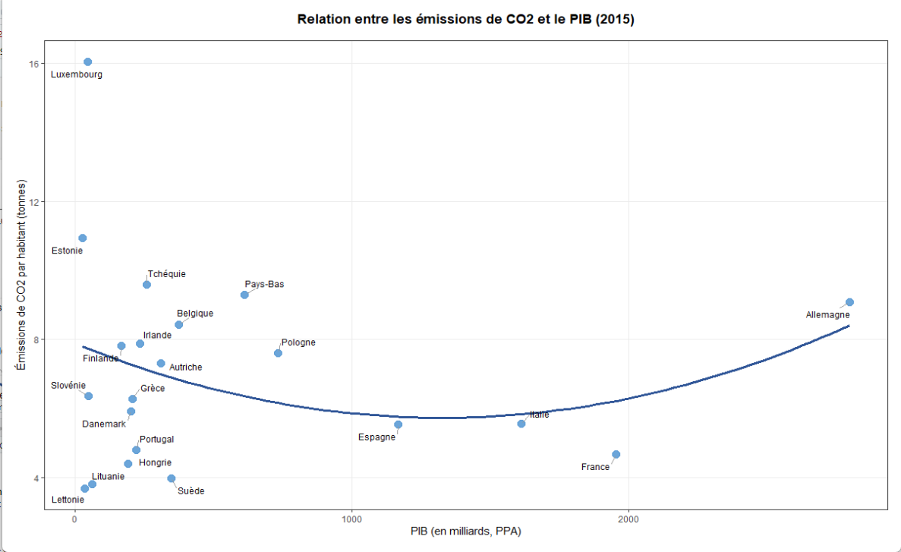
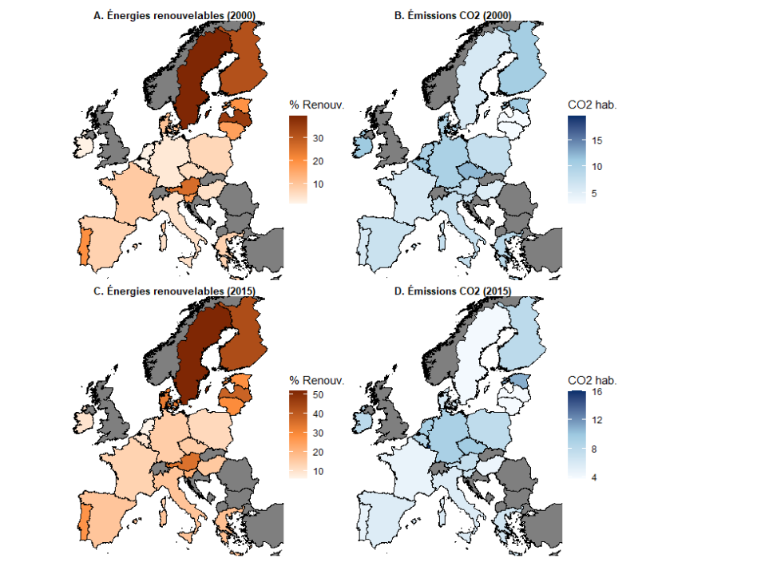

# Emissions-CO2-UE

Analyse économétrique spatiale des émissions de CO2 par habitant dans l’Union européenne, réalisée dans le cadre du **Master 2 ESEF - Université de Lorraine**.  
Le projet combine une approche en **coupe transversale**, en **panel** et en **modélisation binaire probit spatiale** afin d’évaluer le rôle de la richesse, de la transition énergétique, de l’urbanisation et du chômage sur les émissions de CO2.

---

## Objectif du projet

L’objectif est d’expliquer les différences de **CO2 par habitant** entre pays de l’Union européenne et d’examiner si ces écarts présentent une structure spatiale.  
L’étude mobilise plusieurs familles de modèles afin de comparer les résultats selon la spécification retenue :

- Modèle linéaire classique (**OLS**)
- Modèles spatiaux transversaux (**SAR, SEM, SDM, SARAR, SLX**)
- Modèles de panel (**pooling, effets fixes, effets aléatoires, modèles spatiaux panel**)
- Modèles binaires (**probit simple, probit spatial approché 1 étape et 2 étapes**) [file:340][file:341]

---

## Structure du projet

```text
Emissions-CO2-UE/
├── src/
│   ├── images/
│   │   ├── evolution.png
│   │   ├── gdp_co2.png
│   │   └── matrices.png
│   └── main.Rmd
├── README.md
└── main.ipynb
```

Le cœur du projet est contenu dans le fichier `src/main.Rmd`, qui rassemble la préparation des données, les estimations économétriques, les visualisations et les interprétations. [file:342]

---

## Méthodologie

L’étude est organisée en trois parties principales :

### 1. Coupe transversale (2015)
Cette première partie retient l’année 2015 pour analyser les émissions de CO2 par habitant à l’échelle des pays européens.  
Trois matrices de poids spatiaux sont construites :

- **Contiguïté Queen**
- **K plus proches voisins (KNN, k = 4)**
- **Distance-seuil (1500 km)** [file:340]

Un modèle OLS est d’abord estimé, puis plusieurs modèles spatiaux sont comparés à l’aide des tests de Moran, des tests de Rao’s score et des critères d’information AIC. [file:340]

### 2. Données de panel
La seconde partie exploite la dimension temporelle du jeu de données sur un panel équilibré de **21 pays** observés sur **18 années** \((N = 378)\). [file:340]  
Les modèles estimés sont :

- Pooling
- Effets fixes
- Effets aléatoires
- Modèles spatiaux panel (SAR, SEM, SARAR)

Le test de Hausman conduit à retenir les **effets fixes** comme spécification principale. [file:340]

### 3. Modélisation binaire
Enfin, une transformation binaire de la variable de CO2 permet d’opposer les pays au-dessus et en dessous de la médiane des émissions. [file:340]  
Cette partie compare :

- un **probit simple**
- un **probit spatial approché en une étape**
- un **probit spatial approché en deux étapes** [file:340]

---

## Variables utilisées

### Variable dépendante
- `CO2_emissions_per_capita` : émissions de CO2 par habitant

### Variables explicatives
- `GDP_ppp` : niveau de richesse
- `Renewable_energy_consumption_pct` : part des énergies renouvelables
- `Urban_population_pct` : taux d’urbanisation
- `unemp_rate` : taux de chômage [file:340]

Ces variables permettent de relier les émissions à la structure économique, énergétique et démographique des pays étudiés. [file:340]

---

## Principaux résultats

Les résultats montrent que la **part des énergies renouvelables** est la variable la plus robuste de l’étude : son coefficient est négatif et significatif dans la plupart des spécifications, en coupe transversale comme en panel. [file:340]

En coupe transversale, les tests spatiaux ne mettent pas en évidence de dépendance spatiale forte, ce qui rend le modèle **OLS** économétriquement défendable comme modèle principal, avec le **SEM** comme meilleure alternative spatiale. [file:340]

En panel, le modèle à **effets fixes** améliore nettement l’ajustement et absorbe une grande partie de l’hétérogénéité entre pays. Les modèles spatiaux panel n’apportent pas de preuve claire d’une dépendance spatiale forte une fois les effets fixes pris en compte. [file:340]

Dans la partie binaire, le probit spatial approché en une étape obtient le meilleur AIC, mais son interprétation reste prudente en raison de la petite taille de l’échantillon et d’une fragilité numérique au moment de l’estimation. [file:340]

---

## Illustrations

### Matrices de voisinage

Les matrices de voisinage constituent la base de l’analyse spatiale.  
Le projet compare une matrice de contiguïté, une matrice KNN et une matrice par distance.



### Relation entre PIB et émissions de CO2

Le nuage de points suivant met en évidence l’hétérogénéité entre les pays européens et suggère qu’une relation simple entre richesse et émissions n’est pas suffisante.  
Cela justifie l’introduction d’autres variables explicatives et l’usage de modèles plus riches.



### Évolution temporelle

La visualisation temporelle compare la place des énergies renouvelables et les émissions de CO2 entre 2000 et 2015.  
Elle illustre l’intérêt d’une approche en panel pour analyser les trajectoires nationales.



---

## Aperçu du projet

Si tu ajoutes une capture globale de l’environnement de travail dans `src/images/project-structure.png`, tu peux aussi afficher un aperçu du projet ici :


---

## Reproductibilité

Le projet est conçu pour être exécuté à partir du fichier :

```r
src/main.Rmd
```

Il nécessite notamment les bibliothèques R suivantes :

```r
tidyverse
readxl
sf
spdep
spatialreg
plm
splm
countrycode
car
ggplot2
ggrepel
patchwork
knitr
kableExtra
```

Selon ton environnement, il peut aussi être nécessaire de charger les objets cartographiques et les données sources depuis un dossier local. [file:340]

---

## Limites

Cette étude constitue une application rigoureuse d’économétrie spatiale, mais certaines limites doivent être signalées :

- la coupe transversale repose sur un **petit échantillon** de 21 pays ; [file:340]
- les tests détectent une dépendance spatiale **faible** ou peu marquée ; [file:340]
- certains modèles plus complexes, notamment **SARAR** ou le probit spatial approché, doivent être interprétés avec prudence en raison de fragilités numériques. [file:340]

Ces limites n’enlèvent pas l’intérêt du projet, mais elles doivent être prises en compte dans la lecture des résultats. [file:340]

---

## Conclusion

Ce projet met en œuvre une démarche complète d’économétrie spatiale appliquée aux émissions de CO2 dans l’Union européenne.  
Il montre que la transition énergétique, mesurée par la part des énergies renouvelables, constitue le facteur explicatif le plus robuste, tandis que la composante spatiale apparaît globalement limitée dans les données considérées. [file:340]

---

## Auteur

**Moussa SISSOKO**  
Master 2 ESEF — Université de Lorraine

---

## Licence

Projet académique réalisé dans un cadre universitaire.